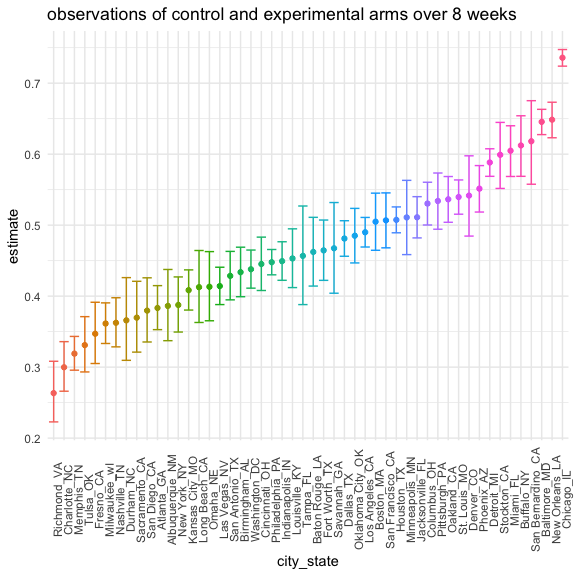

Homework 5
================
Nidhi Patel
11/18/2020

``` r
library(tidyverse)
```

    ## ── Attaching packages ─────────────────────────────────────── tidyverse 1.3.0 ──

    ## ✓ ggplot2 3.3.2     ✓ purrr   0.3.4
    ## ✓ tibble  3.0.3     ✓ dplyr   1.0.2
    ## ✓ tidyr   1.1.2     ✓ stringr 1.4.0
    ## ✓ readr   1.3.1     ✓ forcats 0.5.0

    ## ── Conflicts ────────────────────────────────────────── tidyverse_conflicts() ──
    ## x dplyr::filter() masks stats::filter()
    ## x dplyr::lag()    masks stats::lag()

``` r
library(rvest)
```

    ## Loading required package: xml2

    ## 
    ## Attaching package: 'rvest'

    ## The following object is masked from 'package:purrr':
    ## 
    ##     pluck

    ## The following object is masked from 'package:readr':
    ## 
    ##     guess_encoding

``` r
knitr::opts_chunk$set(
  fig.width = 6,
  fig.height = 6,
  out.width = "90%")

theme_set(theme_minimal() + theme(legend.position = "bottom"))

options(
  ggplot2.continuous.colour = "viridis",
  ggplot2.continuous.fill = "viridis"
)

scale_color_discrete = scale_colour_viridis_d
scale_fill_discrete = scale_fill_viridis_d
```

## Problem 1

#### Read in Data + make vars we want

``` r
homicide = read_csv("./data/homicide-data.csv") %>% 
  unite(city_state, c("city", "state"), sep = "_") %>% 
  mutate(
    solved = ifelse(disposition == "Closed by arrest", rep(TRUE), FALSE))
```

    ## Parsed with column specification:
    ## cols(
    ##   uid = col_character(),
    ##   reported_date = col_double(),
    ##   victim_last = col_character(),
    ##   victim_first = col_character(),
    ##   victim_race = col_character(),
    ##   victim_age = col_character(),
    ##   victim_sex = col_character(),
    ##   city = col_character(),
    ##   state = col_character(),
    ##   lat = col_double(),
    ##   lon = col_double(),
    ##   disposition = col_character()
    ## )

This dataset contains 12 variables with 52179 observations. Each
homicide is distinguished by an unique id, contains basic demographic
information about the victim, the location and reported date of the
murder, and whether an arrest was made.

#### summarize

``` r
resolved_df = 
  homicide %>%
  group_by(city_state) %>% 
  summarize(
    tot_hom = n(),
    unsolved_hom = sum(solved == "FALSE")) %>% 
  filter(city_state != "Tulsa_AL")
```

    ## `summarise()` ungrouping output (override with `.groups` argument)

#### `prop.test` proportions

``` r
prop.test(
  resolved_df %>% filter(city_state == "Baltimore_MD") %>% pull(unsolved_hom),
  resolved_df %>% filter(city_state == "Baltimore_MD") %>% pull(tot_hom)
) %>% #you have to put the actual numbers in the prop test fn. 
  broom::tidy()
```

    ## # A tibble: 1 x 8
    ##   estimate statistic  p.value parameter conf.low conf.high method    alternative
    ##      <dbl>     <dbl>    <dbl>     <int>    <dbl>     <dbl> <chr>     <chr>      
    ## 1    0.646      239. 6.46e-54         1    0.628     0.663 1-sample… two.sided

#### iterate this for every city; make a df for the estimated proportions

``` r
estimate_prop = 
  resolved_df %>% 
  mutate(
    prop_tests = map2(.x = unsolved_hom, .y = tot_hom, ~prop.test(x = .x, n = .y)),
    tidy_tests = map(.x = prop_tests, ~broom::tidy(.x))
) %>% 
  select(-prop_tests) %>% 
  unnest(tidy_tests) %>% 
  select(city_state, estimate, conf.low, conf.high)
```

#### plot estimates and CIs

``` r
estimate_plot = estimate_prop %>% 
  mutate(
    city_state = as_factor(city_state),
    city_state = fct_reorder(city_state, estimate)
  ) %>% 
  ggplot(aes(x = city_state, y = estimate, color = city_state)) +
  geom_point(alpha = 3) +
  geom_errorbar(aes(ymax = conf.high, ymin = conf.low)) +
  theme(legend.position = "none", axis.text.x = element_text(angle = 90))

estimate_plot
```


