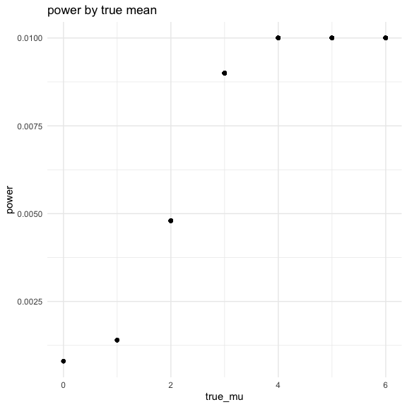
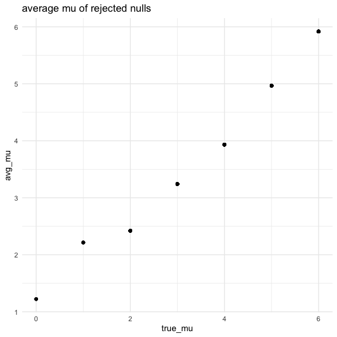

Homework 5
================
Nidhi Patel
11/18/2020

``` r
library(tidyverse)
```

    ## ── Attaching packages ─────────────────────────────────────── tidyverse 1.3.0 ──

    ## ✓ ggplot2 3.3.2     ✓ purrr   0.3.4
    ## ✓ tibble  3.0.3     ✓ dplyr   1.0.2
    ## ✓ tidyr   1.1.2     ✓ stringr 1.4.0
    ## ✓ readr   1.3.1     ✓ forcats 0.5.0

    ## ── Conflicts ────────────────────────────────────────── tidyverse_conflicts() ──
    ## x dplyr::filter() masks stats::filter()
    ## x dplyr::lag()    masks stats::lag()

``` r
library(rvest)
```

    ## Loading required package: xml2

    ## 
    ## Attaching package: 'rvest'

    ## The following object is masked from 'package:purrr':
    ## 
    ##     pluck

    ## The following object is masked from 'package:readr':
    ## 
    ##     guess_encoding

``` r
knitr::opts_chunk$set(
  fig.width = 6,
  fig.height = 6,
  out.width = "90%")

theme_set(theme_minimal() + theme(legend.position = "bottom"))

options(
  ggplot2.continuous.colour = "viridis",
  ggplot2.continuous.fill = "viridis"
)

scale_color_discrete = scale_colour_viridis_d
scale_fill_discrete = scale_fill_viridis_d
```

## Problem 1

#### Read in Data + make vars we want

``` r
homicide = read_csv("./data/homicide-data.csv") %>% 
  unite(city_state, c("city", "state"), sep = "_") %>% 
  mutate(
    solved = ifelse(disposition == "Closed by arrest", rep(TRUE), FALSE))
```

    ## Parsed with column specification:
    ## cols(
    ##   uid = col_character(),
    ##   reported_date = col_double(),
    ##   victim_last = col_character(),
    ##   victim_first = col_character(),
    ##   victim_race = col_character(),
    ##   victim_age = col_character(),
    ##   victim_sex = col_character(),
    ##   city = col_character(),
    ##   state = col_character(),
    ##   lat = col_double(),
    ##   lon = col_double(),
    ##   disposition = col_character()
    ## )

This dataset contains 12 variables with 52179 observations. Each
homicide is distinguished by an unique id, contains basic demographic
information about the victim, the location and reported date of the
murder, and whether an arrest was made.

#### summarize

``` r
resolved_df = 
  homicide %>%
  group_by(city_state) %>% 
  summarize(
    tot_hom = n(),
    unsolved_hom = sum(solved == "FALSE")) %>% 
  filter(city_state != "Tulsa_AL")
```

    ## `summarise()` ungrouping output (override with `.groups` argument)

#### `prop.test` proportions

``` r
prop.test(
  resolved_df %>% filter(city_state == "Baltimore_MD") %>% pull(unsolved_hom),
  resolved_df %>% filter(city_state == "Baltimore_MD") %>% pull(tot_hom)
) %>% #you have to put the actual numbers in the prop test fn. 
  broom::tidy()
```

    ## # A tibble: 1 x 8
    ##   estimate statistic  p.value parameter conf.low conf.high method    alternative
    ##      <dbl>     <dbl>    <dbl>     <int>    <dbl>     <dbl> <chr>     <chr>      
    ## 1    0.646      239. 6.46e-54         1    0.628     0.663 1-sample… two.sided

#### iterate this for every city; make a df for the estimated proportions

``` r
estimate_prop = 
  resolved_df %>% 
  mutate(
    prop_tests = map2(.x = unsolved_hom, .y = tot_hom, ~prop.test(x = .x, n = .y)),
    tidy_tests = map(.x = prop_tests, ~broom::tidy(.x))
) %>% 
  select(-prop_tests) %>% 
  unnest(tidy_tests) %>% 
  select(city_state, estimate, conf.low, conf.high)
```

#### plot estimates and CIs

``` r
estimate_plot = estimate_prop %>% 
  mutate(
    city_state = as_factor(city_state),
    city_state = fct_reorder(city_state, estimate)
  ) %>% 
  ggplot(aes(x = city_state, y = estimate, color = city_state)) +
  geom_point(alpha = 3) +
  geom_errorbar(aes(ymax = conf.high, ymin = conf.low)) +
  theme(legend.position = "none", axis.text.x = element_text(angle = 90)) +
  labs(title = "observations of control and experimental arms over 8 weeks"
  )

estimate_plot
```


## Problem 2

Create a df with all the patients.

#### make the dataframe and tidy

``` r
study_df =
  tibble(
    files = list.files("data/data/"),
    path = str_c("data/data/", files)
  ) %>% 
  mutate(data = map(.x = path, ~read_csv(.x))) %>% 
  unnest(data) %>% 
  mutate(rename = str_replace(files, ".csv", "")) %>% 
  separate(rename, into = c("arm", "sub_id"), sep = 3) %>% 
  mutate(sub_id = str_replace(sub_id, "_", "")) %>% 
  pivot_longer(
    week_1:week_8,
    names_to = "week",
    names_prefix = "week_",
    values_to = "obvs"
  ) %>% 
  select(arm, sub_id, week, obvs)
```

    ## Parsed with column specification:
    ## cols(
    ##   week_1 = col_double(),
    ##   week_2 = col_double(),
    ##   week_3 = col_double(),
    ##   week_4 = col_double(),
    ##   week_5 = col_double(),
    ##   week_6 = col_double(),
    ##   week_7 = col_double(),
    ##   week_8 = col_double()
    ## )
    ## Parsed with column specification:
    ## cols(
    ##   week_1 = col_double(),
    ##   week_2 = col_double(),
    ##   week_3 = col_double(),
    ##   week_4 = col_double(),
    ##   week_5 = col_double(),
    ##   week_6 = col_double(),
    ##   week_7 = col_double(),
    ##   week_8 = col_double()
    ## )
    ## Parsed with column specification:
    ## cols(
    ##   week_1 = col_double(),
    ##   week_2 = col_double(),
    ##   week_3 = col_double(),
    ##   week_4 = col_double(),
    ##   week_5 = col_double(),
    ##   week_6 = col_double(),
    ##   week_7 = col_double(),
    ##   week_8 = col_double()
    ## )
    ## Parsed with column specification:
    ## cols(
    ##   week_1 = col_double(),
    ##   week_2 = col_double(),
    ##   week_3 = col_double(),
    ##   week_4 = col_double(),
    ##   week_5 = col_double(),
    ##   week_6 = col_double(),
    ##   week_7 = col_double(),
    ##   week_8 = col_double()
    ## )
    ## Parsed with column specification:
    ## cols(
    ##   week_1 = col_double(),
    ##   week_2 = col_double(),
    ##   week_3 = col_double(),
    ##   week_4 = col_double(),
    ##   week_5 = col_double(),
    ##   week_6 = col_double(),
    ##   week_7 = col_double(),
    ##   week_8 = col_double()
    ## )
    ## Parsed with column specification:
    ## cols(
    ##   week_1 = col_double(),
    ##   week_2 = col_double(),
    ##   week_3 = col_double(),
    ##   week_4 = col_double(),
    ##   week_5 = col_double(),
    ##   week_6 = col_double(),
    ##   week_7 = col_double(),
    ##   week_8 = col_double()
    ## )
    ## Parsed with column specification:
    ## cols(
    ##   week_1 = col_double(),
    ##   week_2 = col_double(),
    ##   week_3 = col_double(),
    ##   week_4 = col_double(),
    ##   week_5 = col_double(),
    ##   week_6 = col_double(),
    ##   week_7 = col_double(),
    ##   week_8 = col_double()
    ## )
    ## Parsed with column specification:
    ## cols(
    ##   week_1 = col_double(),
    ##   week_2 = col_double(),
    ##   week_3 = col_double(),
    ##   week_4 = col_double(),
    ##   week_5 = col_double(),
    ##   week_6 = col_double(),
    ##   week_7 = col_double(),
    ##   week_8 = col_double()
    ## )
    ## Parsed with column specification:
    ## cols(
    ##   week_1 = col_double(),
    ##   week_2 = col_double(),
    ##   week_3 = col_double(),
    ##   week_4 = col_double(),
    ##   week_5 = col_double(),
    ##   week_6 = col_double(),
    ##   week_7 = col_double(),
    ##   week_8 = col_double()
    ## )
    ## Parsed with column specification:
    ## cols(
    ##   week_1 = col_double(),
    ##   week_2 = col_double(),
    ##   week_3 = col_double(),
    ##   week_4 = col_double(),
    ##   week_5 = col_double(),
    ##   week_6 = col_double(),
    ##   week_7 = col_double(),
    ##   week_8 = col_double()
    ## )
    ## Parsed with column specification:
    ## cols(
    ##   week_1 = col_double(),
    ##   week_2 = col_double(),
    ##   week_3 = col_double(),
    ##   week_4 = col_double(),
    ##   week_5 = col_double(),
    ##   week_6 = col_double(),
    ##   week_7 = col_double(),
    ##   week_8 = col_double()
    ## )
    ## Parsed with column specification:
    ## cols(
    ##   week_1 = col_double(),
    ##   week_2 = col_double(),
    ##   week_3 = col_double(),
    ##   week_4 = col_double(),
    ##   week_5 = col_double(),
    ##   week_6 = col_double(),
    ##   week_7 = col_double(),
    ##   week_8 = col_double()
    ## )
    ## Parsed with column specification:
    ## cols(
    ##   week_1 = col_double(),
    ##   week_2 = col_double(),
    ##   week_3 = col_double(),
    ##   week_4 = col_double(),
    ##   week_5 = col_double(),
    ##   week_6 = col_double(),
    ##   week_7 = col_double(),
    ##   week_8 = col_double()
    ## )
    ## Parsed with column specification:
    ## cols(
    ##   week_1 = col_double(),
    ##   week_2 = col_double(),
    ##   week_3 = col_double(),
    ##   week_4 = col_double(),
    ##   week_5 = col_double(),
    ##   week_6 = col_double(),
    ##   week_7 = col_double(),
    ##   week_8 = col_double()
    ## )
    ## Parsed with column specification:
    ## cols(
    ##   week_1 = col_double(),
    ##   week_2 = col_double(),
    ##   week_3 = col_double(),
    ##   week_4 = col_double(),
    ##   week_5 = col_double(),
    ##   week_6 = col_double(),
    ##   week_7 = col_double(),
    ##   week_8 = col_double()
    ## )
    ## Parsed with column specification:
    ## cols(
    ##   week_1 = col_double(),
    ##   week_2 = col_double(),
    ##   week_3 = col_double(),
    ##   week_4 = col_double(),
    ##   week_5 = col_double(),
    ##   week_6 = col_double(),
    ##   week_7 = col_double(),
    ##   week_8 = col_double()
    ## )
    ## Parsed with column specification:
    ## cols(
    ##   week_1 = col_double(),
    ##   week_2 = col_double(),
    ##   week_3 = col_double(),
    ##   week_4 = col_double(),
    ##   week_5 = col_double(),
    ##   week_6 = col_double(),
    ##   week_7 = col_double(),
    ##   week_8 = col_double()
    ## )
    ## Parsed with column specification:
    ## cols(
    ##   week_1 = col_double(),
    ##   week_2 = col_double(),
    ##   week_3 = col_double(),
    ##   week_4 = col_double(),
    ##   week_5 = col_double(),
    ##   week_6 = col_double(),
    ##   week_7 = col_double(),
    ##   week_8 = col_double()
    ## )
    ## Parsed with column specification:
    ## cols(
    ##   week_1 = col_double(),
    ##   week_2 = col_double(),
    ##   week_3 = col_double(),
    ##   week_4 = col_double(),
    ##   week_5 = col_double(),
    ##   week_6 = col_double(),
    ##   week_7 = col_double(),
    ##   week_8 = col_double()
    ## )
    ## Parsed with column specification:
    ## cols(
    ##   week_1 = col_double(),
    ##   week_2 = col_double(),
    ##   week_3 = col_double(),
    ##   week_4 = col_double(),
    ##   week_5 = col_double(),
    ##   week_6 = col_double(),
    ##   week_7 = col_double(),
    ##   week_8 = col_double()
    ## )

#### Spagetti plot

``` r
study_df %>% 
  group_by(arm, sub_id) %>% 
  ggplot(aes(x = week, y = obvs)) +
  geom_point(aes(color = arm)) +
  geom_path(aes(group = sub_id, color = arm))
```


There are some visual differences in the control and experimental
outcomes of this longitudinal study. Both control and experimental
observations consistently varied between -1.25 and 2.75. Throughout the
weeks, the experimental observations trended upwards and the control
observations remained relatively the same. The control group looks like
it trended slightly downward, but it is difficult to tell whether this
is the true effect, or due to a smaller sample size.

## Problem 3

Simulation to explore power of a one sample t-test\!\!

#### Write the function for true mean = 0. Save in tibble

``` r
ttest_sim = function(mu) {
  sim_data = 
    tibble(
    x = rnorm(mean = mu, n = 30, sd = 5),
    )
  
  ttest = t.test(sim_data, mu = 0, alpha = 0.05)
  
  results_sim0 = tibble(
    pvalue = ttest[["p.value"]],
    mean = ttest[["estimate"]]
  )
}
```

#### Reiterate function

``` r
sim_results =
  tibble(true_mu = c(0:6)) %>% 
  mutate(
    output_lists = map(.x = true_mu, ~rerun(50, ttest_sim(mu = .x))),
    ttest_df = map(output_lists, bind_rows)
  ) %>% 
  select(-output_lists) %>% 
  unnest(ttest_df)
```

#### Proportion of null rejected (power)

``` r
proportion = 
  sim_results %>% 
  filter(pvalue < 0.05) %>% 
  group_by(true_mu) %>% 
  mutate(
    rejected = n(),
    power = rejected / 5000) %>% 
  ggplot(aes(x = true_mu, y = power)) +
  geom_point() +
  labs(
    title = "power by true mean",
    xlab = "true mean",
    ylab = "power"
  )

proportion
```



I originally had a very strange outcome, but fixed my function to
produce this plot, which is expected. I would expect mu = 6 to be
rejected more and have a higher power than all the other mu’s. I would
expect all others to have decreasing power. I expect this because if
true mu = 0 and H0: mu = 0, the likely hood of this being false in a
sample of 5000 is very low, and thus the rejected/power would be a very
low number. In contrast, if true mu = 6 and it is tested against H0:mu =
0, we would expect the null to be rejected because they are not supposed
to be the same, resulting in a higher power proportion. This plot looks
like a logarithmic curve.

#### avg estimate of mu on y and true mu on x

``` r
avg_mu = 
  sim_results %>% 
  group_by(true_mu) %>% 
  mutate(
    avg_mu = mean(mean)) %>% 
  ggplot(aes(x = true_mu, y = avg_mu)) +
  geom_point() +
  labs(
    title = "avg mu estimate by true mu",
    xlab = "true mean",
    ylab = "average mu estimate"
  )
avg_mu
```


Again, I fixed my function and the unexpected plots were changed to what
were expected: I have assumed to see a very direct, linear relationship
between the average mu and true mu. With a normal sample size this
large, we would expect to see the average average to be what is
expected.

#### average estimates of rejected nulls

``` r
avg_reject = 
  sim_results %>% 
  filter(pvalue < 0.05) %>% 
  group_by(true_mu) %>% 
  mutate(
    rejected = n(),
    power = rejected / 5000,
    avg_mu = mean(mean)) %>% 
  ggplot(aes(x = true_mu, y = avg_mu)) +
  geom_point() +
  labs(
    title = "average mu of rejected nulls",
    xlab = "true mean",
    ylab = "average mu"
  )
avg_reject
```



For this plot, we expect to see the average mu of the rejected nulls to
increase as the true mu increases because the average of the samples
should be around the inputted mu. Additionally, there would be a lot
more datapoints for the higher true mu’s as they were more likely to be
rejected. This would make an interesting density or violin plot. The
sample average of mu across tests for which the null is rejected
approximately very slightly greater or sometimes equal to the true value
of mu, with the exception of 0. The rejected average mu is greater than
the true mu. This makes sense because if the sample mu = true mu, it
would not be rejected and in this plot. Unlike mu 1-6, where the sample
mu’s were more likely to be rejected because they are supposed to be
closer to the true mu, which is not equal to H0: mu= 0
